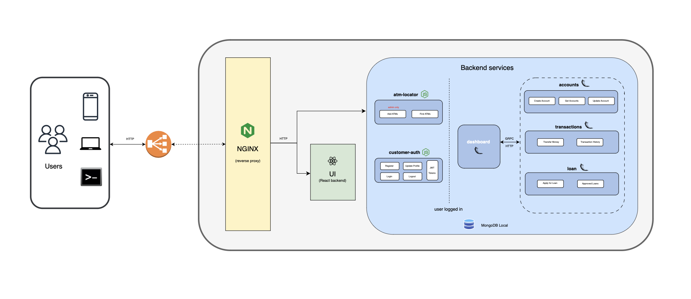

# MARTIAN BANK

 
 
MartianBank is a microservices application that simulates an app to allow customers to access and manage their bank accounts, perform financial transactions, locate ATMs, and apply for loans. It is built using [React](https://react.dev/),[ Node.js](https://nodejs.org/en/about), [Python](https://flask.palletsprojects.com/en/2.3.x/) and is packaged in [Docker](https://www.docker.com/) containers.  

 

# Highlights

- Micro Services Architecture  ​
- Helm based configurable deployments options​ (eg switching between HTTP and GRPC)​
- Docker, Kind and EKS based easy installations​

 

 

#  Application Design

The Martian Bank UI is created using [React](https://react.dev/) and [react-redux toolkit](https://redux-toolkit.js.org/).  There are 6 microservices, out of which 2 (customer-auth and atm-locator) are developed in Node.js whereas the others are done using Flask (Python). The dashboard microservice talks to accounts, transactions and loan microservices using [gRPC](https://grpc.io/) and [http](https://en.wikipedia.org/wiki/HTTP) (can be flipped and is available as a deployment parameter).

 

#  License

[BSD 3-Clause License](https://opensource.org/license/bsd-3-clause/)

